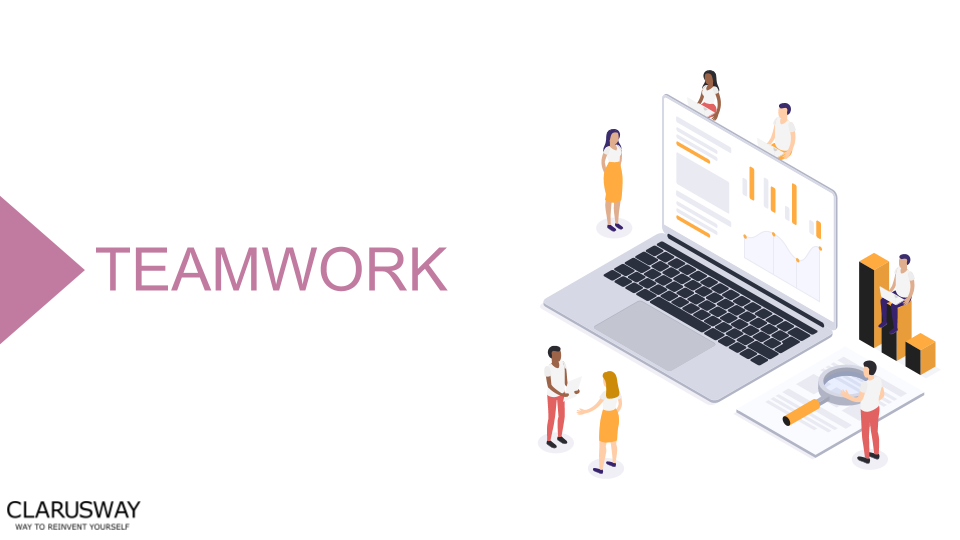

<h1><strong>STUDENT ML Week-1</strong>

 
 

 

<h1><strong>Meeting Agenda</strong></h1>

▶ Icebreaking 

▶ Interview Questions

▶ Coffee Break

▶ Video of the
week

▶ Retro
meeting

▶ Case study /
project

 
 
 

<h1><strong>Teamwork Schedule</strong></h1>

<table style= "width:100%;">
                <tr>
                <td style="color: #FA8072; text-align:left "><h3><strong>
Ice-breaking</td>
                <td style="color: #FA8072; text-align:right;"><h3><strong>
10m
<td>                </tr>
</table>

- Introduction.
- Personal Questions (Study Environment, Kids etc.) 
- Any challenges (Classes, Coding, studying, etc.) 
- Ask how they’re studying, give personal advice. 
- Remind that practice makes perfect. 

 

<table style= "width:100%;">
                <tr>
                <td style="color: #FA8072; text-align:left "><h3><strong>
*******</td>
                <td style="color: #FA8072; text-align:right;"><h3><strong>
<td>                </tr>
</table>
You have successfully completed the Data Analyst path. We congratulate you all. With what you have learned so far, you are ready to apply for Data Analyst positions.
Now, as a new start, you have a machine learning marathon. As the Clarusway Data Science team, we will always be with you to finish this part successfully.

 

 

<table style= "width:100%;">
                <tr>
                <td style="color: #FA8072; text-align:left "><h3><strong>
Interview Questions</td>
                <td style="color: #FA8072; text-align:right;"><h3><strong>
15m
<td>                </tr>
</table>

**1. What is the difference between supervised and unsupervised machine learning?**

**2. What is Bayes’ Theorem? How is it useful in a machine learning context?**
 

 

 

<table style= "width:100%;">
                <tr>
                <td style="color: #FA8072; text-align:left "><h3><strong>
ADDITIONAL RESOURCES</td>
                </tr>
</table>

Please read the following articles related to ML, you can discuss within the group. The articles shared with you below will help you understand your machine learning foundation.

**Basic ML Terminology**

1- [An Introduction to Machine Learning Theory and Its Applications: A Visual Tutorial With Examples](https://www.toptal.com/machine-learning/machine-learning-theory-an-introductory-primer)
  
2- [Machine Learning —Fundamentals](https://towardsdatascience.com/machine-learning-basics-part-1-a36d38c7916#:~:text=Machine%20Learning%20is%20an%20application,be%20at%20least%20human%20level.&text=In%20order%20to%20perform%20the,from%20the%20data%2Dset%20provided.)
  
3- [Regression Analysis in Machine Learning](https://www.javatpoint.com/regression-analysis-in-machine-learning)

4- [Performance Metrics in Classification-Regression](https://iq.opengenus.org/performance-metrics-in-classification-regression/)
 
                
 

 :coffee: 
<table style= "width:100%;">
                <tr>
                <td style="color: #FA8072; text-align:left "><h3><strong>
Coffee Break</td>
                <td style="color: #FA8072; text-align:right;"><h3><strong>
10m
<td>                </tr>
</table>

:coffee:

 
</table>
 

 
<table style= "width:100%;">
                <tr>
                <td style="color: #FA8072; text-align:left "><h3><strong>
Video of the Week</td>
                <td style="color: #FA8072; text-align:right;"><h3><strong>
10m
<td>                </tr>
</table>

- [The 7 steps of machine learning](https://www.youtube.com/watch?v=nKW8Ndu7Mjw&ab_channel=GoogleCloudTech)

 

<table style= "width:97%;">
                <tr>
                <td style="color: #FA8072; text-align:left "><h3><strong>
Retro Meeting on a personal and team level</td>
                <td style="color: #FA8072; text-align:right;"><h3><strong>
10m
<td>                </tr>
</table>

Ask the questions below:

- What went well? 
- What could be improved? 
- What will we commit to do better in the next week? 

 

<table style= "width:105%;">
                <tr>
                <td style="color: #FA8072; text-align:left "><h3><strong>
Closing</td>
                <td style="color: #FA8072; text-align:right;"><h3><strong>
5m
<td>                   </tr>
</table>

- Next week’s plan

- QA Session 

